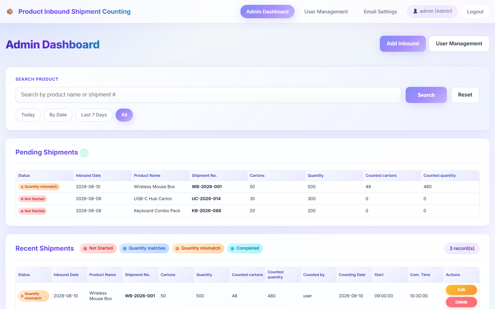
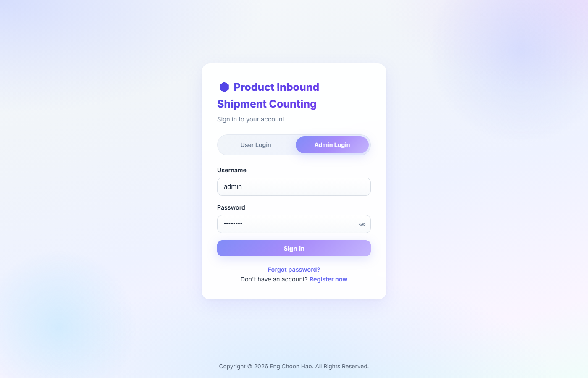
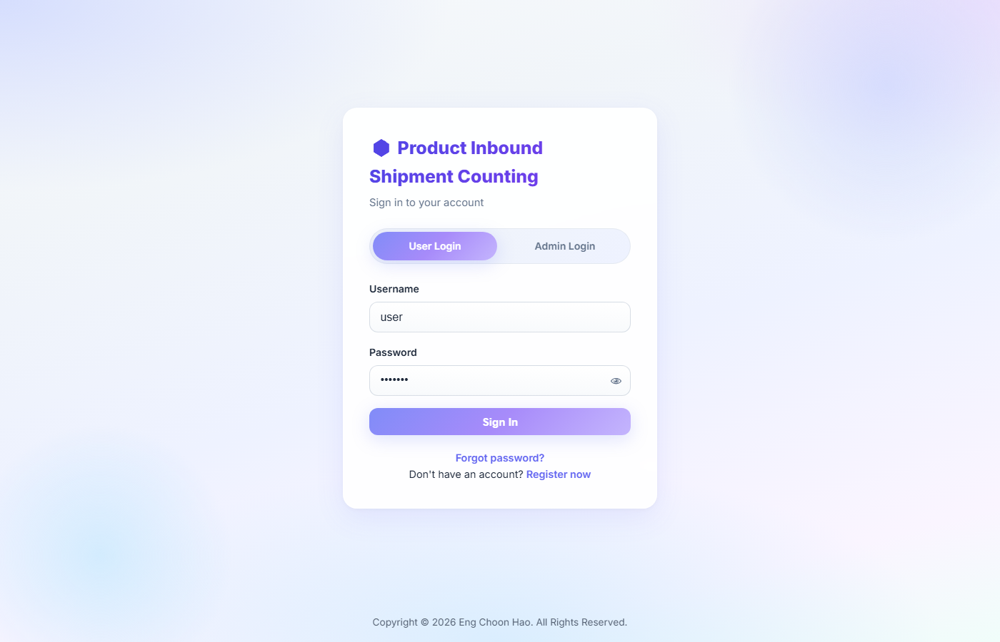
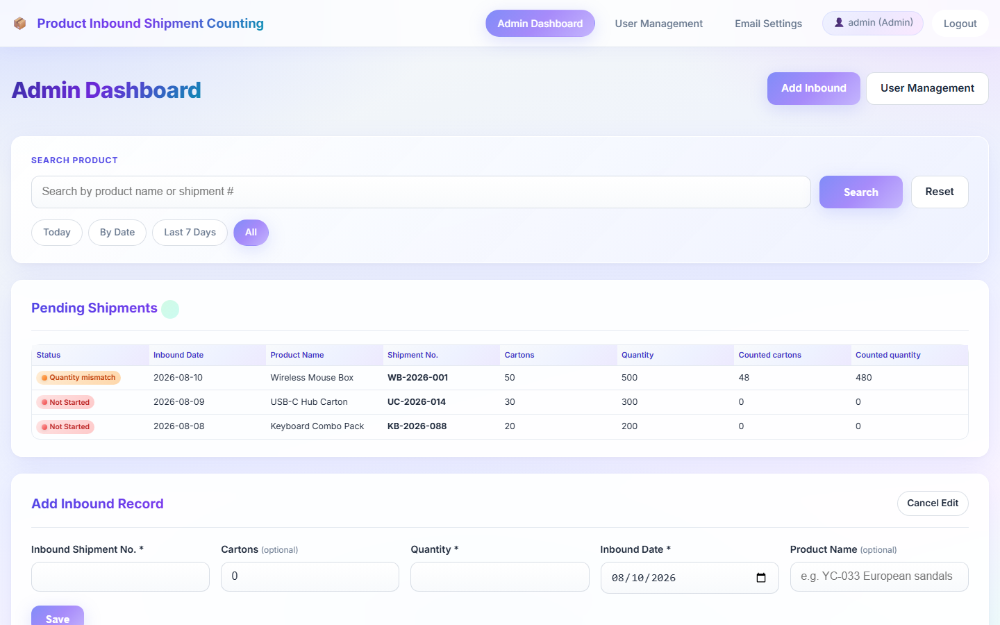
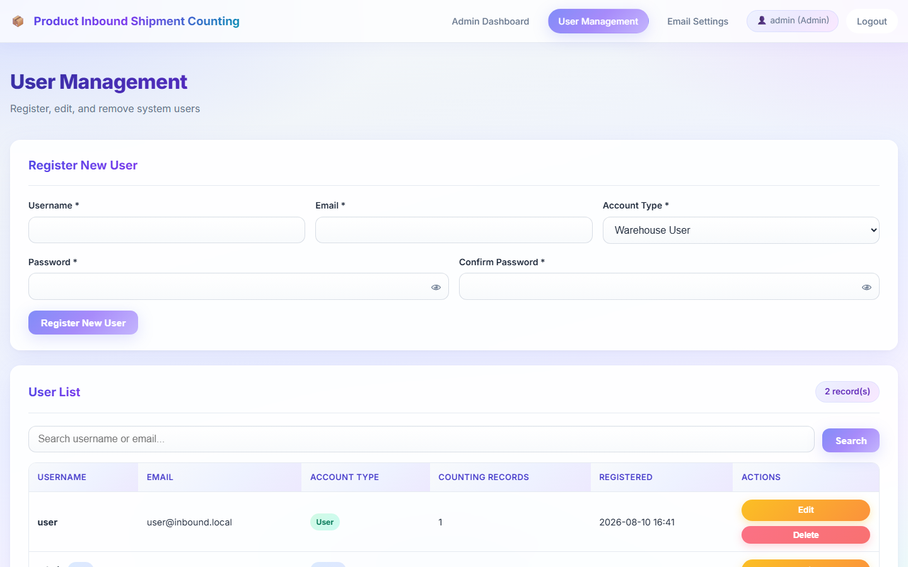
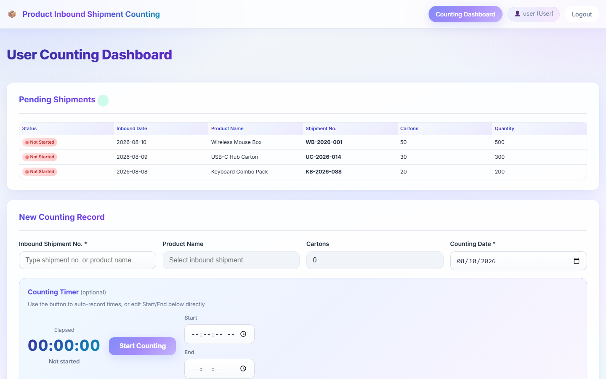
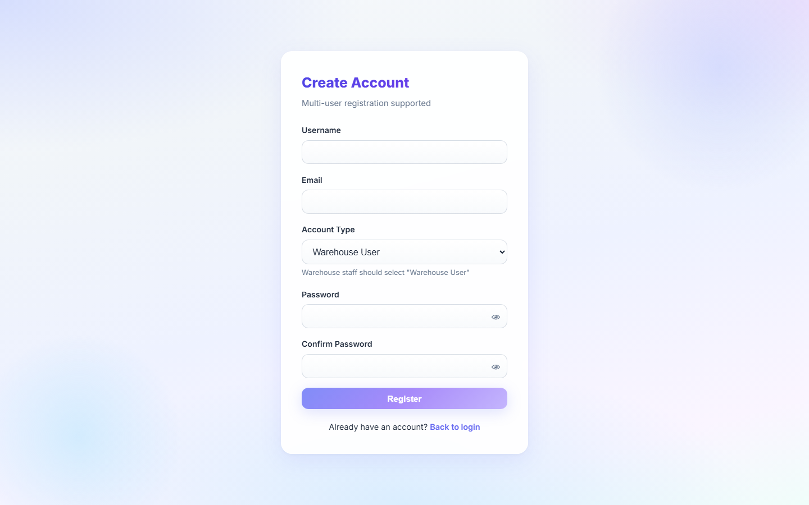
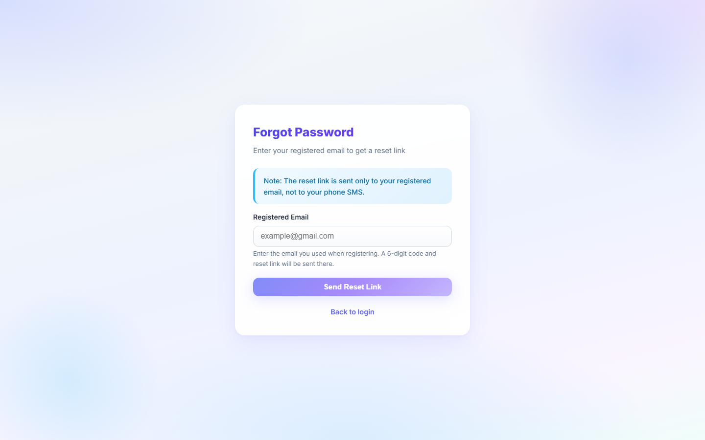
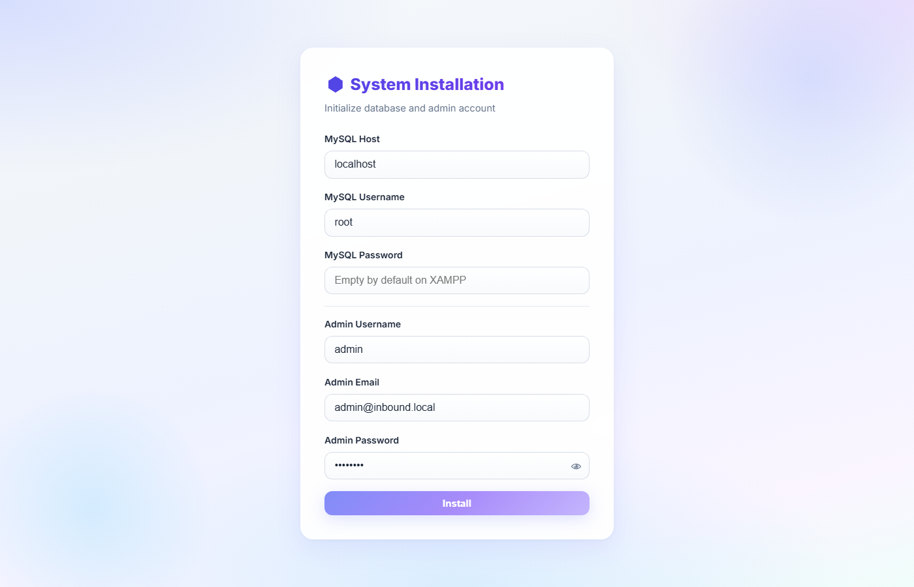

# 📦 **Product Inbound Shipment Counting**

A full-featured **Inbound Shipment Counting Record System** built with **PHP, MySQL, HTML, CSS & JavaScript**.
Admins manage inbound shipments; warehouse users record counted cartons and quantities.

✨ Feel free to explore, contribute, and enhance the project! 🚀

---

## 🎬 **Project Demo Video**

📺 Watch the full system demo (login, inbound records, counting & more):

👉 **[Watch on Google Drive](https://drive.google.com/file/d/1s0JJtM03ImrCnYDX_20kKrT2zqExLyXd/view?usp=sharing)**

---

## ✨ **Features**

- 🔐 **Role-Based Auth** — Separate **Admin** / **Warehouse User** login, registration, show/hide password, and forgot-password reset links
- 📥 **Inbound Records** — Admins create shipments with date, product name, shipment number, cartons & quantity
- 🧮 **Counting Workflow** — Users record counted cartons/quantity with start–end time and optional counting timer
- 🟢🔴 **Live Status Badges** — Not started · Quantity matches · Quantity mismatch · Completed
- 🔍 **Search & Filters** — Search by product / shipment # · Today · By date · Last 7 days · All
- 👥 **User Management** — Register, edit, delete, and search warehouse users from the admin panel
- 📧 **Email Settings** — Configure mail for password reset (PHPMailer)
- 🎨 **Modern UI** — Soft gradient theme, glass navbar, responsive cards & forms

---

## 🏗️ **Tech Stack**

| **Category** | **Technology** |
| --- | --- |
| 🔙 **Backend** | PHP 7.4+ (PDO, sessions) |
| 🗄️ **Database** | MySQL / MariaDB |
| 🖥️ **Frontend** | HTML5, CSS3, JavaScript |
| 📬 **Mail** | PHPMailer |
| 🌐 **Server** | Apache (XAMPP / cPanel) |
| 🔒 **Security** | Prepared statements, XSS escaping, password hashing |

---

## 🖼️ **Project Screenshots**

<p align="center">
  
</p>
<p align="center"><b>📊 Admin Dashboard</b> — search, filters & shipment status</p>

<br/>

<table>
  <tr>
    <td align="center" width="50%">
      <br/>
      <b>🔐 Admin Login</b>
    </td>
    <td align="center" width="50%">
      <br/>
      <b>👤 User Login</b>
    </td>
  </tr>
  <tr>
    <td align="center" width="50%">
      <br/>
      <b>📥 Add Inbound Record</b>
    </td>
    <td align="center" width="50%">
      <br/>
      <b>👥 User Management</b>
    </td>
  </tr>
  <tr>
    <td align="center" width="50%">
      <br/>
      <b>🧮 Counting Dashboard</b>
    </td>
    <td align="center" width="50%">
      <br/>
      <b>📝 Register</b>
    </td>
  </tr>
  <tr>
    <td align="center" width="50%">
      <br/>
      <b>🔑 Forgot Password</b>
    </td>
    <td align="center" width="50%">
      <br/>
      <b>⚙️ One-Click Installer</b>
    </td>
  </tr>
</table>

---

## 📋 **Requirements**

- 💻 XAMPP (Apache + MySQL + PHP 7.4+) **or** a PHP hosting panel
- 📦 Composer (for PHPMailer)
- 🌐 A modern browser

---

## 🚀 **Installation**

1. 📁 Place the project in your web root, for example:
   ```text
   C:\xampp\htdocs\inbount shipment
   ```
2. ▶️ Start **Apache** and **MySQL** (XAMPP Control Panel).
3. 📦 Install dependencies:
   ```bash
   composer install
   ```
4. 🧰 Open the installer once:
   ```text
   http://localhost/inbount%20shipment/install.php
   ```
5. ✅ After a successful install, **delete or rename `install.php`**.
6. 🔑 Log in at:
   ```text
   http://localhost/inbount%20shipment/
   ```

### 🔑 **Default credentials**

| Field | Value |
| --- | --- |
| 👤 Admin username | set during install (e.g. `admin`) |
| 🔒 Admin password | set during install (e.g. `admin123`) |
| 👷 Warehouse user | register via **Register** or Admin → User Management |

> ⚠️ Change the default password after first login.

### 🛠️ **Manual install (optional)**

1. Import `database/schema.sql` in phpMyAdmin
2. Copy `config/database.example.php` → `config/database.local.php` and set credentials
3. Copy `config/email.example.php` → `config/email.local.php` if using mail

---

## 📁 **Folder Structure**

```text
inbount-shipment/
├── admin/                 # Admin dashboard, users, email settings
├── auth/                  # Login, register, forgot / reset password
├── assets/
│   ├── css/
│   └── js/
├── config/                # DB, app, email config (+ examples)
├── database/              # SQL schema
├── docs/
│   └── screenshots/       # README screenshots
├── includes/              # Auth, layout, helpers, mailer
├── lang/                  # Language strings
├── user/                  # Warehouse counting dashboard
├── index.php              # Entry → login
├── install.php            # One-click installer (delete after use)
├── CONTRIBUTING.md
├── LICENSE
└── README.md
```

---

## ✅ **How to Test**

1. Login as **Admin** → add an inbound shipment (product, shipment #, cartons, quantity)
2. Open **User Management** → register a warehouse user
3. Login as **User** → open pending shipments → start counting / save a counting record
4. Back in Admin → check status badges (match / mismatch / completed)
5. Try **Search**, date filters, edit/delete records, and **Forgot password**

---

## 🤝 **Contributing**

Contributions are welcome! Please read [CONTRIBUTING.md](CONTRIBUTING.md) before opening a pull request.

💡 To contribute, check the guidelines and open a PR with a clear description of what you changed.

---

## 📝 **License**

This project is licensed under the [MIT License](LICENSE).

---

## 👨‍💻 **Author**

**Eng Choon Hao**

Copyright © 2026 Eng Choon Hao. All Rights Reserved.

---

⭐ If you find this project helpful, don't forget to **star** the repository! 🌟

Happy coding! 💻🎉